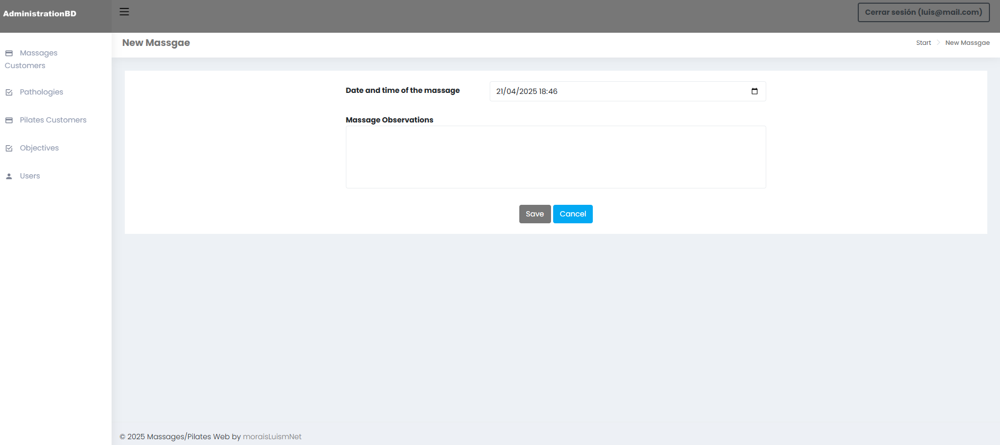
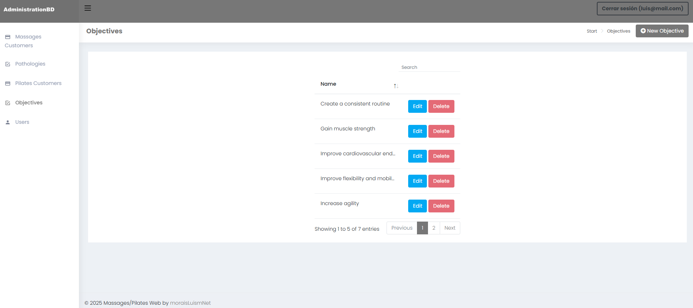

## AdministrationDB

**AdministrationDB** is an Web application for managing information related to Massage and Pilates clients. The integrated management system that enables: Maintain comprehensive customer records, Schedule and manage appointments and sessions, Track health-related information (such as pathologies and objectives), Send appointment notifications and Export data for analysis and reporting. The application also supports user authentication and authorization.


AdministrationDataBase/  
├── Controllers/  
│ ├── AccountController.cs  
│ ├── HomeController.cs  
│ ├── MassageController.cs  
│ ├── MassagesCustomerController.cs  
│ ├── ObjectiveController.cs  
│ ├── PathologyControllerPilates.cs  
│ ├── PilatesCustomerController.cs  
│ ├── SessionController.cs  
│ └── UserController.cs  
│  
├── Helpers/  
│ ├── AdminHelper.cs  
│ ├── CsvExportHelper.cs  
│ ├── DateHelper.cs  
│ ├── EmailHelper.cs  
│ ├── HashHelper.cs  
│ ├── NotificationHelper.cs  
│ ├── PdfExportHelper.cs  
│ ├── TemplateHelper.cs  
│ └── UserHelper.cs  
│  
├── Views/  
│ ├── Account/  
│ │ ├── ChangePassword.cshtml  
│ │ └── Login.cshtml  
│ │  
│ ├── Home/  
│ │ └── Index.cshtml  
│ │  
│ ├── Massage/  
│ │ ├── CreateMassage.cshtml  
│ │ ├── DeleteMassage.cshtml  
│ │ └── EditMassage.cshtml  
│ │  
│ ├── MassagesCustomer/  
│ │ ├── CreateMassagesCustomer.cshtml  
│ │ ├── DeleteMassagesCustomer.cshtml  
│ │ ├── DetailsMassagesCustomer.cshtml  
│ │ ├── EditMassagesCustomer.cshtml  
│ │ └── Index.cshtml  
│ │  
│ ├── Objective/  
│ │ ├── CreateObjective.cshtml  
│ │ ├── DeleteObjective.cshtml  
│ │ ├── EditObjective.cshtml  
│ │ └── Index.cshtml  
│ │  
│ ├── Pathology/  
│ │ ├── CreatePathology.cshtml  
│ │ ├── DeletePathology.cshtml  
│ │ ├── EditPathology.cshtml  
│ │ └── Index.cshtml  
│ │  
│ ├── PilatesCustomer/  
│ │ ├── CreatePilatesCustomer.cshtml  
│ │ ├── DeletePilatesCustomer.cshtml  
│ │ ├── DetailsPilatesCustomer.cshtml  
│ │ ├── EditPilatesCustomer.cshtml  
│ │ └── Index.cshtml  
│ │  
│ ├── Session/  
│ │ ├── CreateSession.cshtml  
│ │ ├── DeleteSession.cshtml  
│ │ └── EditSession.cshtml  
│ │  
│ ├── Shared/  
│ │ ├── _Footer.cshtml  
│ │ ├── _Header.cshtml  
│ │ ├── _Layout.cshtml  
│ │ ├── _LayoutLogin.cshtml  
│ │ └── _Sidebar.cshtml  
│ │  
│ └── User/  
│ ├── CreateUser.cshtml  
│ ├── EditUser.cshtml  
│ └── Index.cshtml  
│  
├── Data/  
│ ├── Context/   
│ │ ├── BDContext.cs        
│ │ └── Connect.cs        
│ │        
│ └── Models/        
│ ├── Massage.cs        
│ ├── MassagesCustomer.cs        
│ ├── MassagesCustomerPathology.cs      
│ ├── MassagesCustomerViewModel.cs      
│ ├── Objective.cs      
│ ├── Observation.cs      
│ ├── Pathology.cs      
│ ├── PilatesCustomer.cs      
│ ├── PilatesCustomerObjective.cs      
│ ├── PilatesCustomerViewModel.cs      
│ ├── Session.cs      
│ └── User.cs      
│      
├── appsettings.json      
└── Program.cs      








## Program
```cs
string connectionString = builder.Configuration.GetConnectionString("Connection");
builder.Services.AddDbContext<BDContext>(options =>
    options.UseSqlite(connectionString));
``` 

## appsetting.json
```cs
{
  "ConnectionStrings": {
    "Connection": "Data Source=AdministrationDB.db"
}
``` 


[DeepWiki moraisLuismNet/AdministrationDB](https://deepwiki.com/moraisLuismNet/AdministrationDB)